# Game Out!

# Table of Contents

- [Application Links](#application-links)
- [Project Plan](#project-plan)
- [Wireframes](#wireframes)
- [Analysis and Solution](#analysis-and-solution)
- [User Stories](#user-stories)
- [Entity Relationship Diagram](#entity-relationship-diagram)
- [Website Flowchart](#website-flowchart)
- [Style Guide](#style-guide)
- [Future Functionality](#future-functionality)
- [References](#references)

---

## Application Links 

### Heroku

[https://gameout.herokuapp.com/](https://gameout.herokuapp.com/)

### Github

[https://github.com/freesam77/game_out](https://github.com/freesam77/game_out)

# Project Plan

# Wireframes

### Link to Figma project 

[https://www.figma.com/file/NbBbbtlL8XYDQeY5GYeTsqiK/Game-Out](https://www.figma.com/file/NbBbbtlL8XYDQeY5GYeTsqiK/Game-Out)

### Desktop Screen screenshots

Home

Login

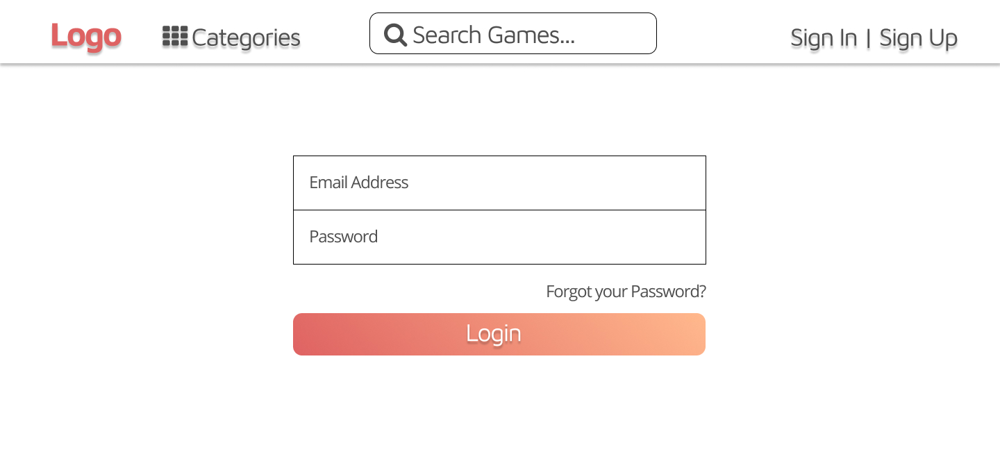

Game Detail

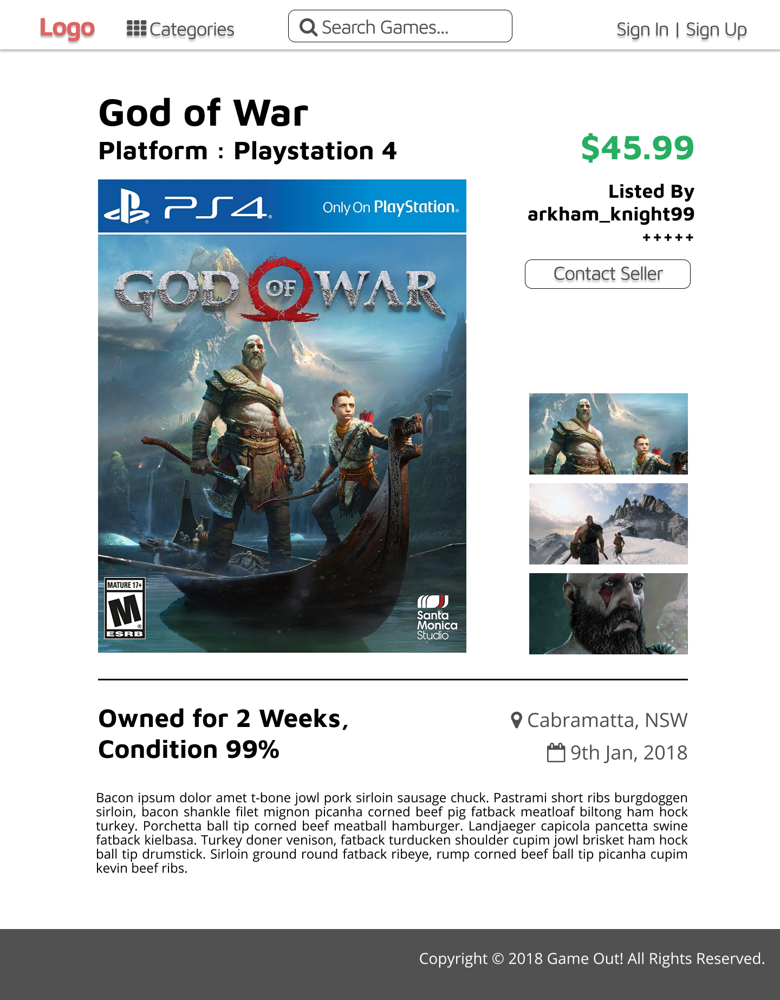

Game Listing

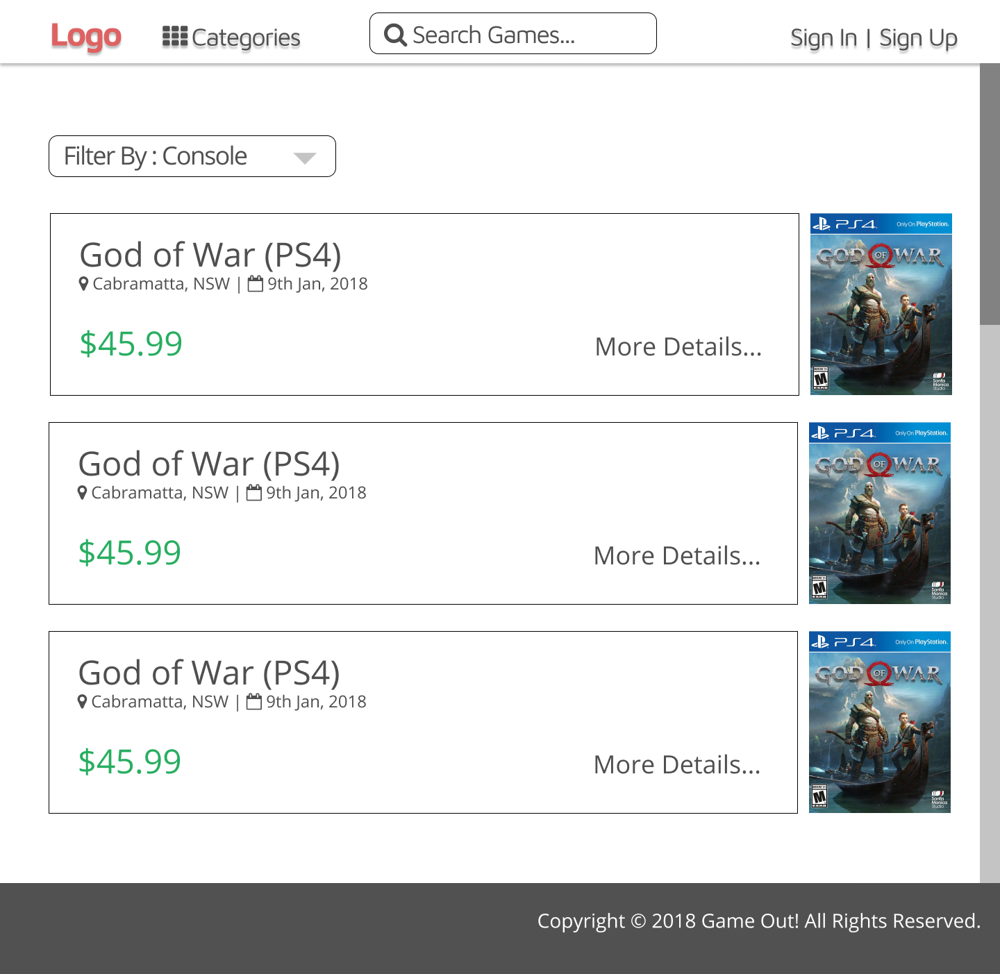

Checkout

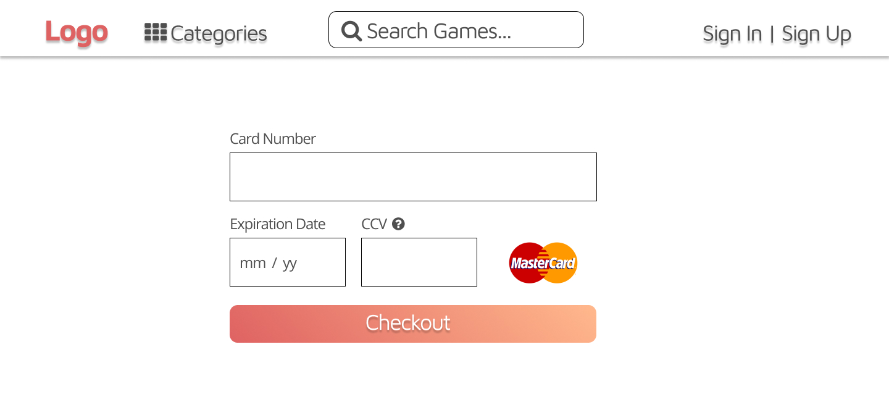

### IPhone Screen screenshots

Home

Login

Game Detail

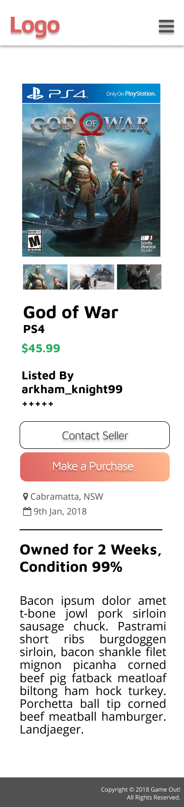

Game Listing

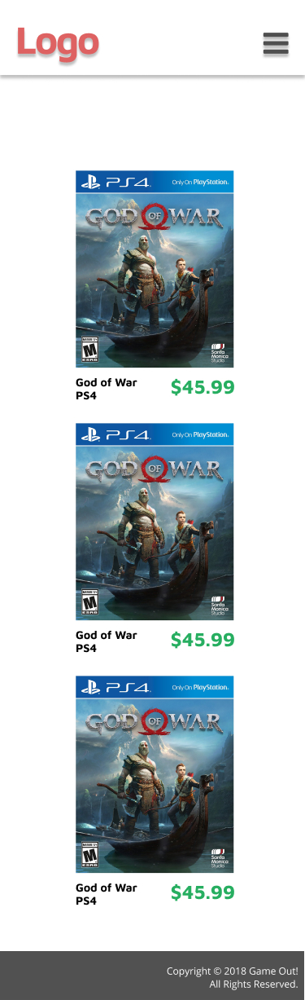

Checkout

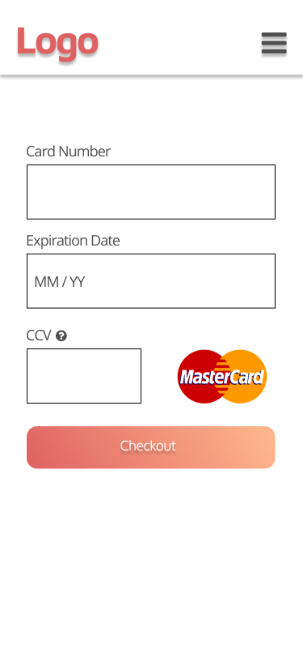

# Analysis And Solution

**Why is there a need for a two-sided online marketplace for video game?**

Rick is a gamer that owns a game, _Monster Hunter_, that he no longer plays. He wants to do a _trade-in_ at EB Games with a new game that has just been released yesterday, God of War. While it is true that he cannot potentially sell the game for the same value to when they bought it first time, these game stores can often undervalue the selling price.

On the other side, Tom has just bought _God of War_ on the release day, returned home, played it for a few hours and decided that the game is too violent for his alley. Refund is not an option once the game's case got ripped off. John has just realized that _Monster Hunter_ seems like a cool game, and so he rushes to EB Games to do a _trade-in_ for that game, but found out that his game's value is already dropped, even though it is just for a day.

**Why online marketplace is the best platform?**

It would be ideal for both Rick and Tom to meet each other, since they have mutual needs. They could trade or swap their game, which could potentially save their cost in comparison to buying a brand new game.

Online platform is just the right platform to facilitate it. They can contact each other and sort out their meeting and payment preferences, and maybe they can trade-off their game with each other with a bit of top-up if needed.

Each user profile will also have ratings on their profile. Other user can also make comments about the seller, so that their credibility is assured.

Once in a while, an event such as meet and greet, or gaming events will also be held by the company to promote sociality between the gamers. 

**What is wrong with existing marketplaces in Australia?**

There has not been a specific two-sided marketplace that focuses on selling used video games in Australia. In existing websites like Gumtree and eBay, there is not enough variety of listing.

**Solution**

By building a specific site that tackles this niche, not only it will bridge the gap of supply and demand in used games, but it will also promote sociality between gamers through interaction from transaction that occurs.

# User Stories

## Preliminaries
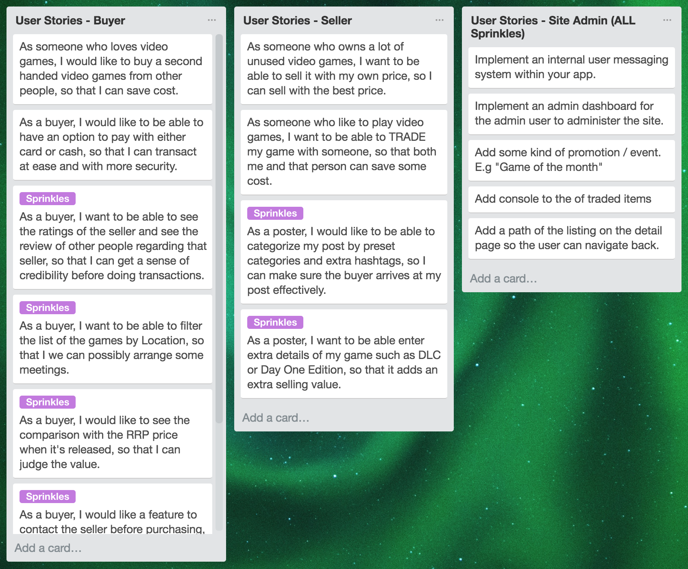

## Detailed

**User should not be able to see the option to interact with the post without logging in**

Feature - Disable visibility of the options for the detail page without signing in

*   As a User
*   I want to log in to be able to do messaging, trading, or purchasing the item
*   Because I only want to be able to view the other party's credentials

Scenario - User logged in and visit the other people's listing detail, and able to interact with it

*   Given I am logged in as a user
*   When I go to other people's listing detail
*   Then I am able to see options to message seller, trade, or purchase the item

**User should only be able to edit their own listing**

Feature - Enable current user to edit his/her own listing

*   As a User
*   I want to have myself as the only authorized user to edit my listing
*   Because I don't want other people to have a control over my listing

Scenario - Users logged in and able to edit their own posts

*   Given I am logged in as a user
*   When I go to my listing page
*   Then I should be able to edit my own listing

**User should not be able to create a new listing without logging in**

Feature - Disable "Create new listing" function when not logged in

*   As a visitor
*   I want to only be able to see people's listing
*   Because I don't want to mess around with other people's listing

Scenario - Browsing the website without logging in

*   Given I am not a logged in user
*   When I visit the listing
*   Then I will not be able to edit or delete the listing

**User should not be able to message themselves or purchase their own listing**

Feature - Disable message and purchase function for user's own listing

*   As a User
*   I want to have message and purchase function hidden from my own listing
*   Because there is no need for me to do so

Scenario - Arrived at user's own listing and not able to do messaging or purchasing

*   Given I am a logged in user
*   When I visit my own listing
*   Then I should not be able to use message and purchasing function

**User should be able to trade other than of purchase**

Feature - An option to trade for every listing

*   As a User
*   I want to have an option to trade/swap my game with another user
*   Because it will probably be better option sometime

Scenario - Arrived at other user's listing and able to use a trade function

*   Given I am a logged in user
*   When I visit other people's listing
*   Then I should be able to trade aside from purchase

**User should be able to sort and filter listing view**

Feature - Enable user to sort and filter the listing view

*   As a User
*   I want to be able to sort and filter the listing
*   Because it would help me find the correct listing faster

Scenario - Using a functionality to sort and filter at index page

*   Given I am a logged in user
*   When I am on the index / listing page
*   Then I should be able to sort and filter out the listing

# Entity Relationship Diagram

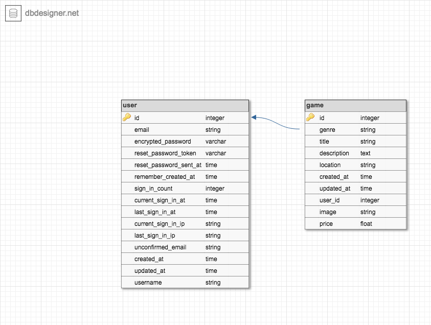

# Website Flowchart

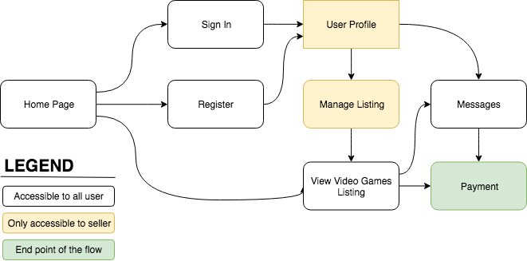

# Style Guide

## Color Palette

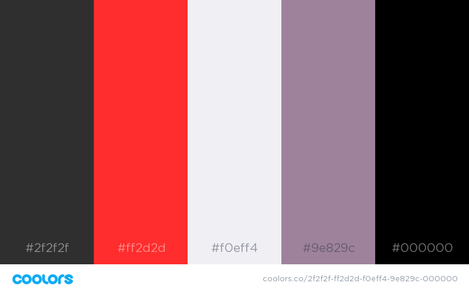

I choose Red and Black as my color palette.

Red is a warm color that symbolize passion, energy, and excitement.

Black symbolizes tradition, authority, and bold.

If you look at other video games website like EB Games, Gamespot, and IGN, they all take warm colors like Red, Orange, or Yellow, with a combination of Black. 

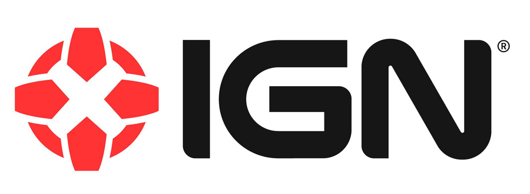

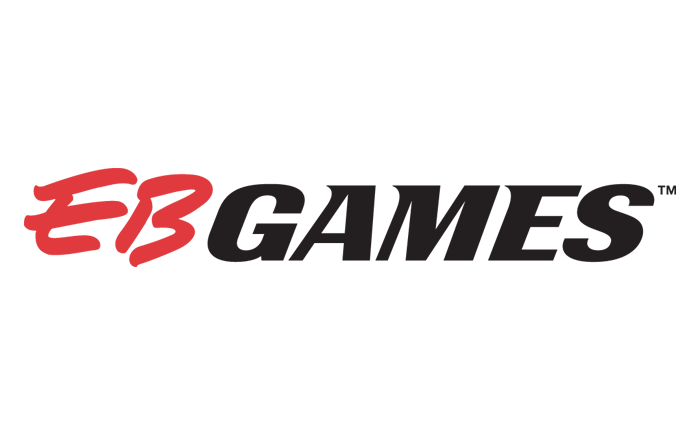
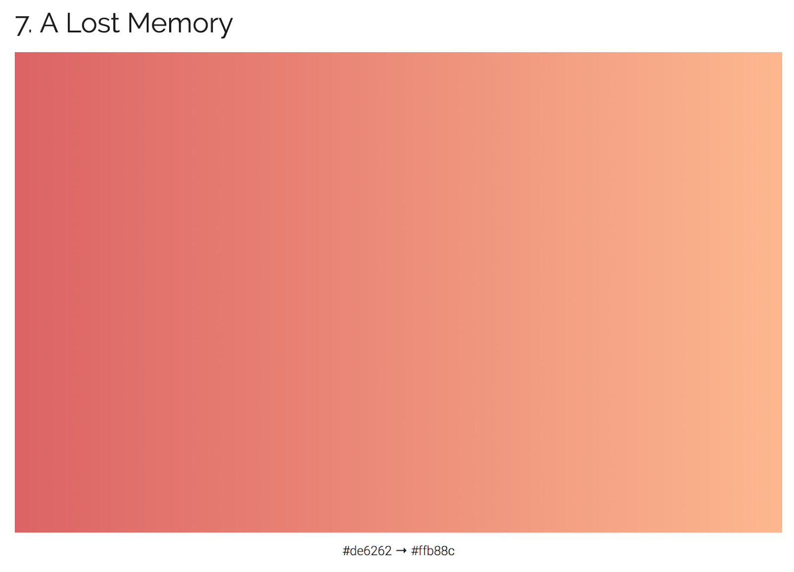

This is the gradient used for buttons.

Source :

_https://digitalsynopsis.com/design/beautiful-color-ui-gradients-backgrounds/_

## Font Choices

### Using Sans Serif

Sans Serif fonts speak about stability, modern and clean. Video game community emphasize these characteristics.

### Heading

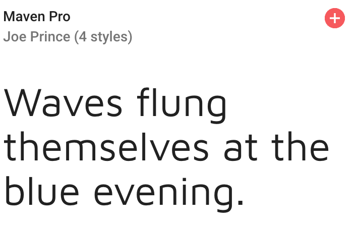

For font style, I'm modelling from IGN's font which is _Ars Maquette_.

I choose Maven Pro which has similar style.

### Paragraph

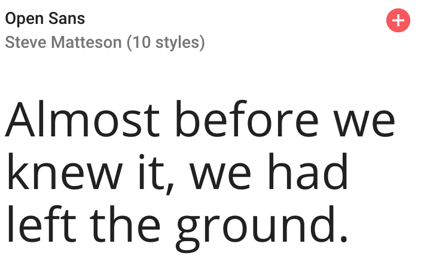

Open Sans is a great combination with Maven Pro as a paragraph text.

---

# Future Functionality

*   Comments and messaging functionality
*   Hashtag elements
*   Profile
*   Comparison between listed price with RRP database

# References

Logo Critiques

[http://www.logocritiques.com/resources/color_psychology_in_logo_design/](http://www.logocritiques.com/resources/color_psychology_in_logo_design/)

Coolors

[https://coolors.co/](https://coolors.co/)

Figma

[https://www.figma.com](https://www.figma.com)

Google Fonts

[https://fonts.google.com/](https://fonts.google.com/)

DBDesigner

[https://www.dbdesigner.net/](https://www.dbdesigner.net/)

Website Building Expert

[https://www.websitebuilderexpert.com/pick-best-font-style-for-website/](https://www.websitebuilderexpert.com/pick-best-font-style-for-website/)
